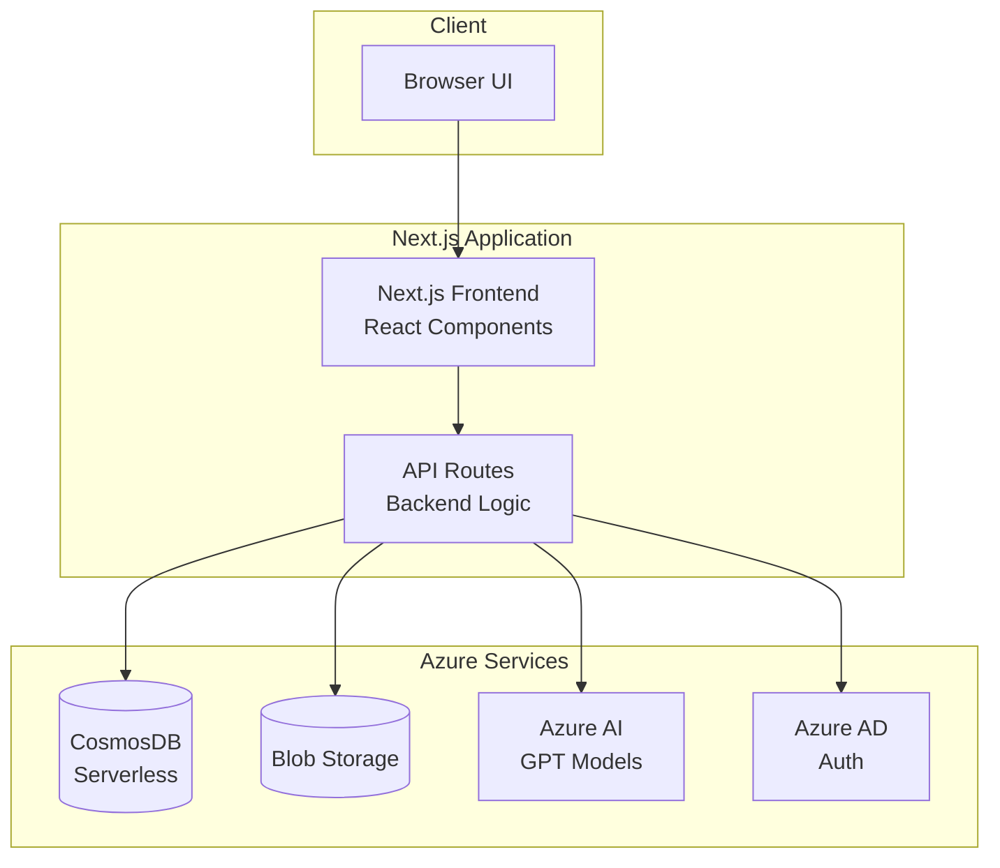
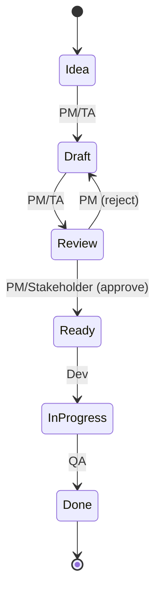

# Design Document

## Overview

SpecCraft is a web-based specification management system built on Next.js 16 with Azure cloud services. The architecture follows a modern serverless approach with a React-based frontend, API routes for backend logic, CosmosDB for data persistence, Azure Blob Storage for file management, and Azure AI for intelligent content generation. The system emphasizes cost efficiency, role-based access control, and real-time collaboration features.

## Architecture

### High-Level Architecture



### Technology Stack

**Frontend:**
- Next.js 16 (App Router)
- React 19
- TailwindCSS 4.x for styling
- Monaco Editor for Markdown editing
- React Markdown for preview rendering
- Mermaid.js for diagram rendering

**Backend:**
- Next.js API Routes (serverless functions)
- Zod for request validation
- Rate limiting middleware

**Database:**
- Azure CosmosDB (MongoDB API, serverless mode)
- Collections: specs, revisions, comments, users, traceability

**Storage:**
- Azure Blob Storage for file attachments
- Lifecycle policies for cost optimization

**AI:**
- Azure OpenAI Service
- Models: gpt-4o-mini (default), gpt-4o (premium)
- Token tracking and quota enforcement

**Authentication:**
- Azure AD B2C or magic link via email
- JWT tokens for session management

## Components and Interfaces

### Frontend Components

#### 1. Spec Editor Component
```typescript
interface SpecEditorProps {
  specId: string;
  initialContent: string;
  initialMetadata: SpecMetadata;
  onSave: (content: string, metadata: SpecMetadata) => Promise<void>;
  readOnly: boolean;
}

interface SpecMetadata {
  title: string;
  status: WorkflowStage;
  type: 'epic' | 'user-story' | 'technical-spec' | 'test-case';
  assignee?: string;
  tags: string[];
  parentId?: string;
}
```

**Responsibilities:**
- Split-pane editor with Markdown input and live preview
- YAML frontmatter editor with validation
- Auto-save every 30 seconds
- Syntax highlighting for code blocks
- Mermaid diagram rendering

#### 2. AI Assistant Panel
```typescript
interface AIAssistantProps {
  selectedText: string;
  context: string;
  onInsert: (text: string) => void;
  onReplace: (text: string) => void;
}

interface AIAction {
  id: string;
  label: string;
  prompt: string;
  estimatedTokens: number;
}
```

**Available Actions:**
- Complete text
- Rewrite for clarity
- Generate acceptance criteria
- Generate test cases
- Summarize content
- Extract tasks
- Translate to another language

#### 3. Version History Component
```typescript
interface VersionHistoryProps {
  specId: string;
  revisions: Revision[];
  onCompare: (rev1: string, rev2: string) => void;
}

interface Revision {
  id: string;
  version: number;
  author: string;
  timestamp: Date;
  content: string;
  metadata: SpecMetadata;
}
```

**Features:**
- Timeline view of all revisions
- Side-by-side and inline diff modes
- Restore previous version capability

#### 4. Traceability Graph Component
```typescript
interface TraceabilityGraphProps {
  rootSpecId: string;
  onNodeClick: (specId: string) => void;
}

interface TraceabilityNode {
  id: string;
  title: string;
  type: SpecMetadata['type'];
  children: TraceabilityNode[];
}
```

**Visualization:**
- Tree layout using D3.js or React Flow
- Color-coded by spec type
- Expandable/collapsible nodes

#### 5. Comments Panel
```typescript
interface CommentsPanelProps {
  specId: string;
  comments: Comment[];
  onAddComment: (text: string, lineRange: LineRange) => Promise<void>;
  onReply: (commentId: string, text: string) => Promise<void>;
}

interface Comment {
  id: string;
  author: string;
  text: string;
  lineRange: LineRange;
  timestamp: Date;
  replies: Comment[];
  mentions: string[];
}

interface LineRange {
  start: number;
  end: number;
}
```

### Backend API Routes

#### 1. Spec Management API
```typescript
// POST /api/specs
interface CreateSpecRequest {
  templateId?: string;
  title: string;
  type: SpecMetadata['type'];
  parentId?: string;
}

// GET /api/specs/:id
interface GetSpecResponse {
  spec: Spec;
  permissions: UserPermissions;
}

// PUT /api/specs/:id
interface UpdateSpecRequest {
  content: string;
  metadata: SpecMetadata;
}

// POST /api/specs/:id/transition
interface TransitionRequest {
  toStage: WorkflowStage;
}
```

#### 2. AI Assistant API
```typescript
// POST /api/ai/generate
interface AIGenerateRequest {
  action: string;
  selectedText: string;
  context: string;
  model?: 'gpt-4o-mini' | 'gpt-4o';
}

interface AIGenerateResponse {
  generatedText: string;
  tokensUsed: number;
  model: string;
  metadata: {
    timestamp: Date;
    action: string;
  };
}

// GET /api/ai/quota
interface QuotaResponse {
  dailyLimit: number;
  used: number;
  remaining: number;
  resetsAt: Date;
}
```

#### 3. Version History API
```typescript
// GET /api/specs/:id/revisions
interface GetRevisionsResponse {
  revisions: Revision[];
}

// GET /api/specs/:id/revisions/compare
interface CompareRevisionsRequest {
  rev1: string;
  rev2: string;
}

interface CompareRevisionsResponse {
  diff: DiffBlock[];
}

interface DiffBlock {
  type: 'added' | 'removed' | 'unchanged';
  content: string;
  lineNumber: number;
}
```

#### 4. Comments API
```typescript
// POST /api/specs/:id/comments
interface CreateCommentRequest {
  text: string;
  lineRange: LineRange;
  mentions: string[];
}

// POST /api/comments/:id/replies
interface CreateReplyRequest {
  text: string;
  mentions: string[];
}

// GET /api/specs/:id/comments
interface GetCommentsResponse {
  comments: Comment[];
}
```

#### 5. Traceability API
```typescript
// POST /api/traceability/link
interface CreateLinkRequest {
  parentId: string;
  childId: string;
}

// GET /api/traceability/graph/:specId
interface GetGraphResponse {
  graph: TraceabilityNode;
}

// DELETE /api/traceability/link
interface DeleteLinkRequest {
  parentId: string;
  childId: string;
}
```

#### 6. File Upload API
```typescript
// POST /api/files/upload
interface UploadFileRequest {
  file: File;
  specId: string;
}

interface UploadFileResponse {
  fileId: string;
  url: string;
  expiresAt: Date;
}

// GET /api/files/:id
interface GetFileResponse {
  url: string;
  expiresAt: Date;
}
```

## Data Models

### CosmosDB Collections

#### Specs Collection
```typescript
interface Spec {
  _id: string;
  title: string;
  content: string; // Markdown content
  metadata: SpecMetadata;
  createdBy: string;
  createdAt: Date;
  updatedBy: string;
  updatedAt: Date;
  currentVersion: number;
}
```

#### Revisions Collection
```typescript
interface RevisionDocument {
  _id: string;
  specId: string;
  version: number;
  content: string;
  metadata: SpecMetadata;
  author: string;
  timestamp: Date;
}
```

#### Comments Collection
```typescript
interface CommentDocument {
  _id: string;
  specId: string;
  parentCommentId?: string; // For replies
  author: string;
  text: string;
  lineRange: LineRange;
  mentions: string[];
  timestamp: Date;
}
```

#### Users Collection
```typescript
interface User {
  _id: string;
  email: string;
  name: string;
  role: 'PM' | 'TA' | 'Dev' | 'QA' | 'Stakeholder';
  createdAt: Date;
}
```

#### Traceability Collection
```typescript
interface TraceabilityLink {
  _id: string;
  parentId: string;
  childId: string;
  createdBy: string;
  createdAt: Date;
}
```

#### AI Usage Collection
```typescript
interface AIUsageLog {
  _id: string;
  userId: string;
  specId: string;
  action: string;
  model: string;
  tokensUsed: number;
  timestamp: Date;
}
```

#### File Attachments Collection
```typescript
interface FileAttachment {
  _id: string;
  specId: string;
  fileName: string;
  blobPath: string;
  contentType: string;
  size: number;
  uploadedBy: string;
  uploadedAt: Date;
}
```

### Workflow State Machine



## Error Handling

### Error Response Format
```typescript
interface ErrorResponse {
  error: {
    code: string;
    message: string;
    details?: any;
  };
}
```

### Error Codes
- `AUTH_REQUIRED`: User not authenticated
- `FORBIDDEN`: Insufficient permissions
- `NOT_FOUND`: Resource does not exist
- `VALIDATION_ERROR`: Invalid request data
- `QUOTA_EXCEEDED`: AI token quota exceeded
- `RATE_LIMIT`: Too many requests
- `INTERNAL_ERROR`: Server error

### Error Handling Strategy

**Frontend:**
- Display user-friendly error messages in toast notifications
- Retry failed requests with exponential backoff (max 3 attempts)
- Log errors to browser console for debugging
- Graceful degradation when AI service is unavailable

**Backend:**
- Validate all inputs with Zod schemas
- Catch and log all exceptions
- Return appropriate HTTP status codes
- Implement circuit breaker for external services (Azure AI)

## Testing Strategy

### Unit Tests
- Test individual React components with React Testing Library
- Test API route handlers with mock database
- Test utility functions and helpers
- Target: 70% code coverage

### Integration Tests
- Test API endpoints with real CosmosDB emulator
- Test authentication flows
- Test file upload to Blob Storage emulator
- Test AI integration with mock responses

### End-to-End Tests
- Test critical user flows with Playwright:
  - Create spec → Edit → Save → View history
  - Use AI assistant → Insert generated content
  - Add comments → Mention user → Verify notification
  - Transition workflow stages with different roles
  - Create traceability links → View graph

### Performance Tests
- Load test API endpoints (target: <200ms p95)
- Test concurrent editing scenarios
- Measure AI response times
- Monitor database query performance

## Security Considerations

### Authentication & Authorization
- All API routes require valid JWT token
- Role-based access control enforced at API layer
- Session tokens expire after 24 hours
- Refresh token rotation for extended sessions

### Data Protection
- HTTPS only in production
- Sensitive data encrypted at rest in CosmosDB
- Blob Storage uses private containers with SAS tokens
- No PII in logs or error messages

### Input Validation
- Sanitize all user inputs to prevent XSS
- Validate file uploads (type, size, content)
- Rate limiting on all API endpoints (100 req/min per user)
- CSRF protection on state-changing operations

### AI Safety
- Tag all AI-generated content
- Implement content filtering for inappropriate outputs
- User review required before inserting AI content
- Audit log for all AI requests

## Deployment Architecture

### Development Environment
- Local Next.js dev server
- CosmosDB emulator
- Azurite for Blob Storage emulation
- Mock Azure AI responses

### Production Environment
- Azure Static Web Apps for frontend hosting
- Azure Functions for API routes (alternative to Next.js API routes)
- CosmosDB serverless (pay-per-request)
- Azure Blob Storage with lifecycle policies
- Azure OpenAI Service with quota limits
- Azure Application Insights for monitoring

### CI/CD Pipeline
1. Run linting and type checking
2. Execute unit and integration tests
3. Build Next.js application
4. Deploy to Azure Static Web Apps
5. Run smoke tests against production

## Cost Optimization

### Database
- Use CosmosDB serverless mode (no minimum charge)
- Implement efficient queries with proper indexing
- Archive old revisions to Blob Storage after 90 days

### AI Usage
- Default to gpt-4o-mini (10x cheaper than gpt-4o)
- Enforce daily token quotas per project
- Cache common AI responses
- Batch AI requests when possible

### Storage
- Implement Blob Storage lifecycle policies (move to cool tier after 30 days)
- Compress file attachments
- Limit file size to 10 MB

### Compute
- Use serverless functions (pay per execution)
- Implement aggressive caching (CDN, browser cache)
- Optimize bundle size with code splitting

**Target Monthly Cost:** <$50 for MVP with 10 active users
