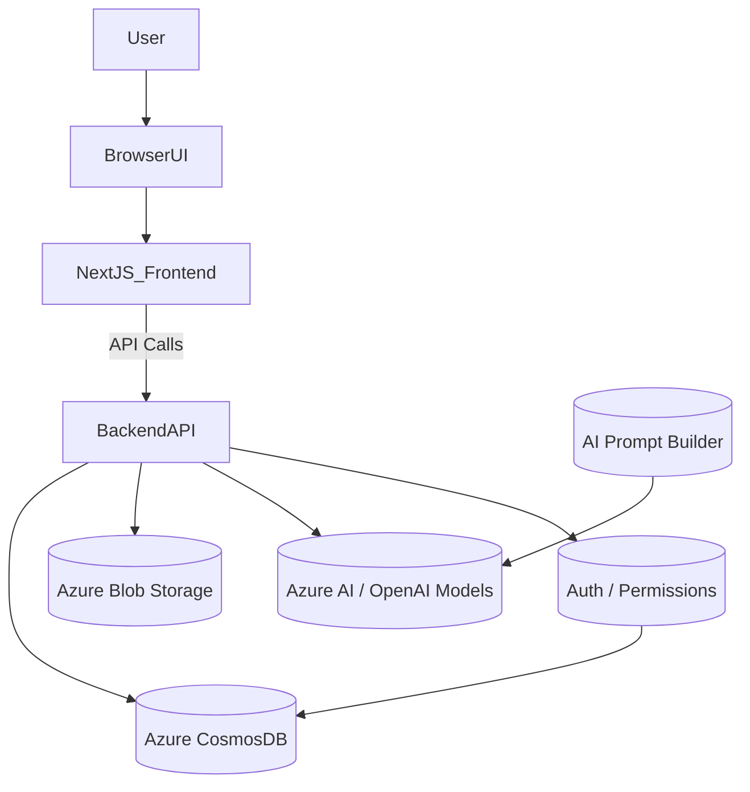
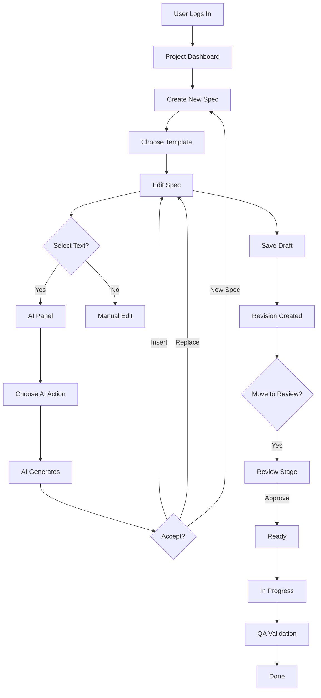

# Product Requirements Document (PRD) — SpecCraft

## 1. Product Overview
SpecCraft is a lightweight but powerful specification workspace designed for product teams to create, manage, and evolve product documentation from Idea → Epic → User Story → Technical Spec → Acceptance → QA, all in a single workspace. The system is Markdown-native, supports structured metadata (YAML frontmatter), and integrates AI assistance powered by Azure AI.

## 2. Problem Statement
Teams struggle with fragmented documentation across tools. Issues include lack of consistency, missing traceability, inefficient handoff, heavy drafting workload, no versioning, and hard onboarding. SpecCraft provides a unified, AI-supported documentation workflow.

## 3. Product Goals
1. Centralize all specifications.
2. Provide clear workflow and traceability.
3. Reduce writing workload using AI.
4. Offer strong versioning.
5. Support export, sharing, collaboration.
6. Minimize cloud cost for MVP.

## 4. Personas
- **PM**: organize backlog, review specs.
- **TA**: create technical specs.
- **Dev**: consume specs, link PRs.
- **QA**: create/verify test cases.
- **Stakeholder**: read/approve docs.

## 5. Core Features (MVP)
### 5.1 Markdown Spec Editor
- Live preview
- YAML frontmatter editor
- Slash commands
- Mermaid diagrams

### 5.2 AI Assistant (Azure AI)
- Complete, rewrite, summarize
- Generate acceptance criteria, test cases
- Extract tasks, explain, translate
- Token cost estimation, rate limiting

### 5.3 Spec Lifecycle Workflow
Default: Idea → Draft → Review → Ready → In Progress → Done

### 5.4 Role-Based Permissions
PM full access; TA create/edit; Dev comment/In Progress; QA add tests; Stakeholder approve.

### 5.5 Versioning System
Each save becomes a revision with diff viewer.

### 5.6 Traceability Graph (MVP)
Epic → User Stories → Technical Specs / Test Cases.

## 6. Non-Goals (MVP)
No Jira sync, GitHub automation, enterprise RBAC, custom workflow builder.

## 7. Success Metrics
- 50% reduction in spec-writing time
- 60% of specs AI-assisted
- 70% fewer revision errors
- Onboarding time −30%
- Cloud cost < $50/month

## 8. Functional Requirements
### 8.1 Specs Management
Templates, metadata editor, stored in CosmosDB.

### 8.2 AI Interaction Panel
User selects text → AI suggestions tagged with metadata.

### 8.3 Workflow Rules
PM/TA move to Review; PM/Stakeholder approve; Dev sets In Progress; QA sets Done.

### 8.4 Comments
Threaded comments, mentions, email notifications.

### 8.5 Version History
Revision compare, inline + side-by-side.

## 9. Technical Requirements (MVP)
### Frontend
Next.js 16, TailwindCSS 4.x, pnpm.

### Backend
Next.js API routes or Azure Functions; markdown parsing; rate limiter.

### Database
Azure CosmosDB (serverless, Mongo API).

### AI
Azure AI models (gpt-4o-mini, gpt-4o). Token caps, quotas.

### Authentication
Azure AD or magic link login.

### File Storage
Azure Blob Storage.

## 10. Logical Architecture Diagram

## 11. UX Flowchart

## 12. Cost Optimization Strategy
- CosmosDB serverless
- Use gpt-4o-mini primarily
- Token caps & daily quotas
- Azure Static Web Apps + Azure Functions
- Blob lifecycle policy
- Free SendGrid tier for notifications

## 13. Risks & Mitigations
- AI hallucinations → tag suggestions
- High cost → quotas, monitoring
- Editor complexity → guided templates
- Privacy concerns → redaction, optional local model

## 14. Future Enhancements
Jira/GitHub integrations, custom workflow builder, diagram generation, AI reviewer, enterprise mode.

